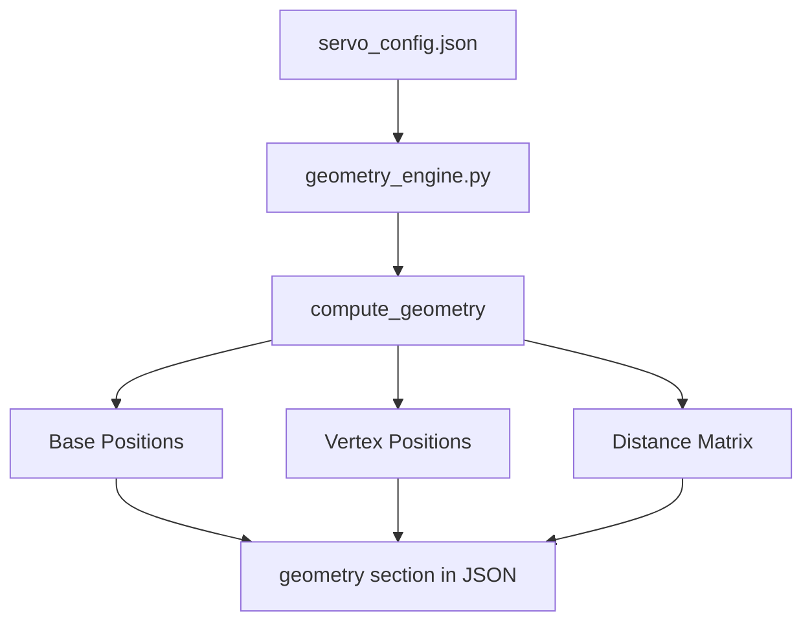

# Geometry Configuration Reference
# 지오메트리 설정 레퍼런스

이 문서는 `servo_config.json`의 `geometry` 섹션에 사용되는 프로퍼티들의 의미를 설명합니다.

---

## Section Overview / 섹션 개요

```
geometry/
├── coordinate_system   # 좌표계 정의
├── origin             # 원점 기준
├── share_points/      # 공유 지점 (카메라 상 원점)
├── bases/             # 로봇 팔 기저부 좌표
├── vertices/          # 그리퍼 도달 지점
└── distances/         # 사전 계산된 거리 행렬
```

---

## Property Definitions / 프로퍼티 정의

### `coordinate_system`
- **Type**: `string`
- **Example**: `"+X=right, +Y=up"`
- **Description**: 좌표계 축 방향 정의. 화면 기준 오른쪽이 +X, 위쪽이 +Y

### `origin`
- **Type**: `string`
- **Example**: `"share_point"`
- **Description**: 모든 좌표의 기준점. 두 로봇 팔의 공유 영역 중심점

---

### `share_points`
공유 지점의 좌표. 현재 원점(0,0)으로 고정.

| Property | Type | Description |
|----------|------|-------------|
| `left_arm.x` | float | Left arm 공유점 X (항상 0) |
| `left_arm.y` | float | Left arm 공유점 Y (항상 0) |
| `right_arm.x` | float | Right arm 공유점 X (항상 0) |
| `right_arm.y` | float | Right arm 공유점 Y (항상 0) |

---

### `bases`
**로봇 팔의 기저부(어깨) 위치**. FK 계산으로 산출.

| Property | Type | Unit | Description |
|----------|------|------|-------------|
| `x` | float | mm | 기저부 X 좌표 (Share Point 기준) |
| `y` | float | mm | 기저부 Y 좌표 (Share Point 기준) |
| `sources` | int | - | 계산에 사용된 vertex 수 (검증용) |

**Example**:
```json
"left_arm": {
  "x": -252.7,    // Share Point 좌측 252.7mm
  "y": -44.1,     // Share Point 아래 44.1mm
  "sources": 1    // 1개 vertex로 계산됨
}
```

---

### `vertices`
**그리퍼 도달 지점 (작업 포인트)**. 각 vertex는 특정 팔이 도달할 수 있는 위치.

| Property | Type | Unit | Description |
|----------|------|------|-------------|
| `x` | float | mm | Vertex X 좌표 (Share Point 기준) |
| `y` | float | mm | Vertex Y 좌표 (Share Point 기준) |
| `owner` | string | - | 소유 팔 (`"left_arm"` / `"right_arm"`) |
| `reach` | float | mm | 해당 팔 Base에서 이 Vertex까지의 거리 |

**Vertex Numbering Convention / 번호 규칙**:
```
V1, V2 → left_arm 소유
V3, V4 → right_arm 소유
```

**Example**:
```json
"1": {
  "x": -198.3,        // Share Point 좌측 198.3mm
  "y": 200.2,         // Share Point 위 200.2mm
  "owner": "left_arm",
  "reach": 250.3      // Left Base에서 250.3mm 거리
}
```

---

### `distances`
**사전 계산된 거리 행렬**. 검증 및 시각화에 사용.

#### `vertex_to_vertex`
Vertex 간 거리. 키 형식: `"<vid1>_<vid2>"`

```json
"1_2": 406.8   // V1 ↔ V2 거리: 406.8mm
"1_3": 548.0   // V1 ↔ V3 거리: 548.0mm (대각선)
```

#### `base_to_vertex`
각 Base에서 모든 Vertex까지의 거리.

```json
"left_arm": {
  "1": 250.3,   // Left Base → V1 (자체 소유)
  "2": 185.3,   // Left Base → V2 (자체 소유)
  "3": 480.9,   // Left Base → V3 (상대 팔 소유)
  "4": 514.3    // Left Base → V4 (상대 팔 소유)
}
```

#### `share_point_to_vertex`
원점(Share Point)에서 각 Vertex까지의 거리.

```json
"1": 281.8,  // Origin → V1
"2": 260.4,  // Origin → V2
"3": 267.6,  // Origin → V3
"4": 296.5   // Origin → V4
```

#### `base_to_base`
두 로봇 팔 Base 간의 거리.

```json
"base_to_base": 524.3  // Left Base ↔ Right Base
```

---

## Calculation Flow / 계산 흐름



---

## Related Files / 관련 파일

| File | Role |
|------|------|
| `geometry_engine.py` | 모든 geometry 계산의 원천 |
| `servo_manager.py` | `compute_geometry()` 래퍼 |
| `geometry_visualizer.py` | matplotlib 시각화 |
| `verify_engine.py` | 거리 검증 도구 |

---

## Notes / 참고사항

1. **단위**: 모든 좌표와 거리는 **mm (밀리미터)** 단위
2. **원점**: Share Point가 항상 (0, 0)
3. **좌표계**: 수학적 직교좌표계 (+X: 오른쪽, +Y: 위쪽)
4. **sources**: Base 좌표 계산에 사용된 vertex 수. 다중 sources 지원 예정

